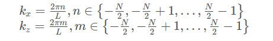
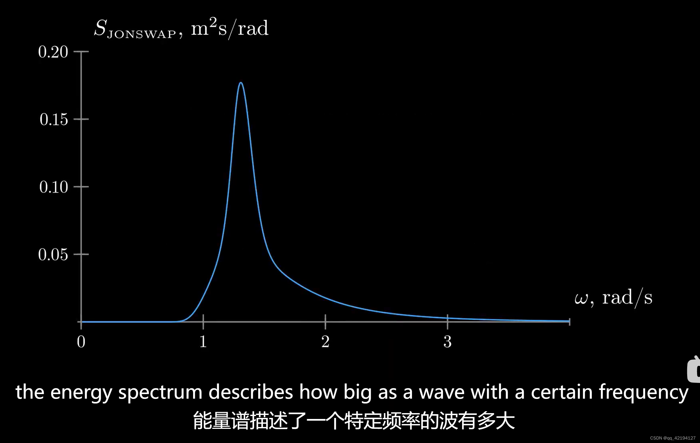

# FFTOceanWave By Unity
说明：这个是FFT海面波浪模拟的Unity版本

[DirectX-11](https://github.com/Li-ZhuoHang/FFTOceanWave_by_DirectX-11)的版本请查看[Li-ZhuoHang/FFTOceanWave_by_DirectX-11 (github.com)](https://github.com/Li-ZhuoHang/FFTOceanWave_by_DirectX-11)

### 先看效果：

#### Shaded:

#### Wireframe:

#### Shaded Wireframe:

### 思路

预计算阶段
计算静态海洋频谱值 h0

频谱计算阶段
在此阶段进行更新，引入时间变量

计算高度偏移频谱、水平偏移频谱、法线频谱

逆傅里叶变换阶段
进行二维傅里叶变换

得到偏移数据以及法线数据

最终处理阶段
对数据进行整合

理论
参考https://zhuanlan.zhihu.com/p/64414956

海面的IDFT模型

此方程为二维逆傅里叶变换

其中k空间的两个分量定义为

## 海洋频谱

**菲利普频谱（Phillips spectrum）**

其中

即其共轭复数

更准确来说是（h是海洋深度）

g是重力常数

其中 ξr 和 ξi 是相互独立的随机数，均服从均值为0，标准差为1的正态分布。

V为风速

具体含义如下

## 法线

因为求导的线性性质，h的梯度值仍然是IDFT形式，可以用IDFT计算

Gerstner wave
https://www.bilibili.com/video/BV1E64y1D78T?spm_id_from=333.880.my_history.page.click&vd_source=0cfebf737cf740b1e5610209f09e99a8

Gerstner wave进行了水平偏移，压缩海浪形成尖角

在IDFT中的形式为

快速傅里叶变化 FFT
参见https://www.bilibili.com/video/BV1Y7411W73U?spm_id_from=333.337.search-card.all.click

这方面的知识已经有很多讲解，这里不做详解

对图像进行横纵FFT/IFFT即可得到二维FFT

